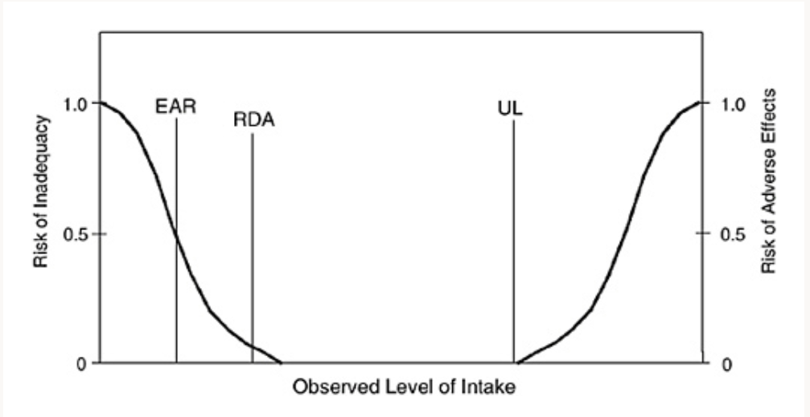

# Nutritional Paradigm

## Overview

I don't believe in good foods or bad foods. I believe that foods conatain pieces of matter whice our bodies try to:

1. Digest for parts
2. Digest for energy
3. Attempt to Discard

## Lower Limits

Our bodies deperately need some kinds of matter. Without them our bodies can suffer sideffects of inadequacy.

## Upper Limits

Our bodies can tolerate all kinds of matter, but always up to a limit. This is true for both toxins which we have no use for, as well as essential nutrients. So there is always a dangerous upper limit.

## Quatifying

Thus there are some important figures that we should note for any macro or micro nutrient.

- **Estimated Average Requirement (EAR)** 50% of people are good here
- **Recomended Daily Allowance (RDA)** 97% of people are good here
- **Adequate Intake (AI)** ~100% of people are good here
- **Upper Limit (UL)** recommended for preventing disease

<!-- + Estimated Energy Requirement (EER) -->

